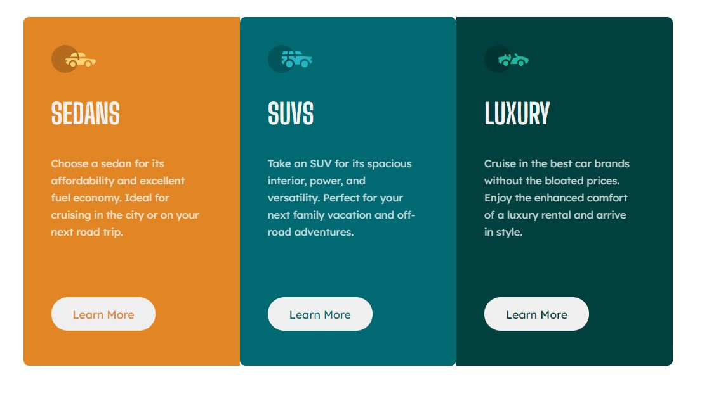
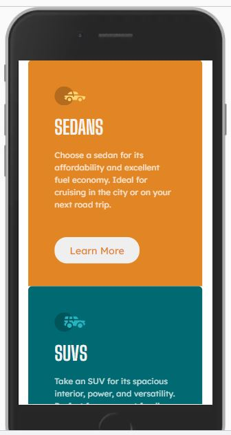

# Frontend Mentor - 3-column preview card component solution

This is a solution to the [3-column preview card component challenge on Frontend Mentor](https://www.frontendmentor.io/challenges/3column-preview-card-component-pH92eAR2-). Frontend Mentor challenges help you improve your coding skills by building realistic projects.

## Table of contents

- [Overview](#overview)
  - [The challenge](#the-challenge)
  - [Screenshot](#screenshot)
  - [Links](#links)
- [My process](#my-process)
  - [Built with](#built-with)
  - [What I learned](#what-i-learned)
- [Author](#author)

**Note: Delete this note and update the table of contents based on what sections you keep.**

## Overview

### The challenge

Users should be able to:

- View the layout depending on their device's screen size

### Screenshot

### Mobile

### Links

- Solution URL: [Add solution URL here](https://github.com/Lucas-Santos-085/3-column-challenge/tree/master)

## My process

### Built with

- HTML5
- CSS3
- Flexbox

### What I learned

That´s my first project. I guess it was useful to start learning, but i have to improve surely.

## Author

- Frontend Mentor - [@Lucas-Santos-085](https://www.frontendmentor.io/profile/Lucas-Santos-085)
